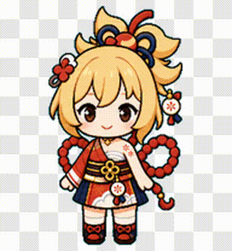

# Codex Fan Pets

Fan-made custom pets for Codex.

## Pets

| Klee / 可莉 | yoimiya宵宫 |
|---|---|
|  |  |
| `klee` | `yoimiya宵宫` |

These are fan-made Codex pets inspired by characters from Genshin Impact.

This project is unofficial and is not affiliated with OpenAI, Codex, HoYoverse, or Genshin Impact.

## Install

From this repository root:

```powershell
$pet = "yoimiya宵宫" # or "klee"
$dest = "$env:USERPROFILE\.codex\pets\$pet"
New-Item -ItemType Directory -Force -Path $dest | Out-Null
Copy-Item ".\pets\$pet\pet.json", ".\pets\$pet\spritesheet.webp" -Destination $dest -Force
```

Then open Codex and refresh custom pets from the appearance settings.

## Usage

Personal use only. Do not sell, redistribute, or claim these assets as official.

Genshin Impact, Klee, and Yoimiya belong to HoYoverse.
